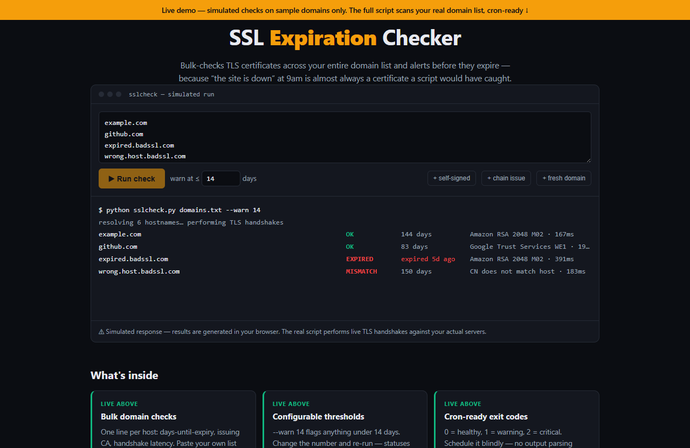

# SSL Expiration Checker — live demo

  

  <a href="https://amos-mig.github.io/ssl-expiration-checker-api-demo/"><strong>▶ Open the live demo</strong></a> ·
  <a href="https://amosmign.gumroad.com/l/ssl-expiration-checker-api"><strong>Get the full product · €29</strong></a>

## What this is

A live simulated run of the SSL Expiration Checker: paste domains, set a warning threshold, and watch a terminal-style scan classify each host as OK, WARN, EXPIRED, MISMATCH or CHAIN-ERR with days-until-expiry, issuer, latency and a cron-friendly exit code. Locked cards tease the full script's deep chain/SNI validation and Slack/SMTP/webhook alerting.

**Try it:** Click Run check, then add the self-signed or chain-issue sample domains and lower the warn threshold to watch statuses and the exit code re-classify.

## What you get in the full product

- Bulk-checks certificates for lists of domains
- Reports days-until-expiry with configurable warning thresholds
- Validates chain issues and hostname mismatches
- Cron-ready with clean output and exit codes
- Single Python file — runs anywhere, no agents to install

## About

- **Storefront:** [kits.amosmignery.dev](https://kits.amosmignery.dev) — single-file products, instant download, commercial license
- **Checkout:** [Gumroad](https://amosmign.gumroad.com/l/ssl-expiration-checker-api) (Merchant of Record, VAT handled)
- **Full product:** [SSL Expiration Checker](https://amosmign.gumroad.com/l/ssl-expiration-checker-api) · €29

## License

The demo page in this repo is MIT-licensed — reuse the technique, not the product.
The **SSL Expiration Checker** itself is not included here and is not free software.
